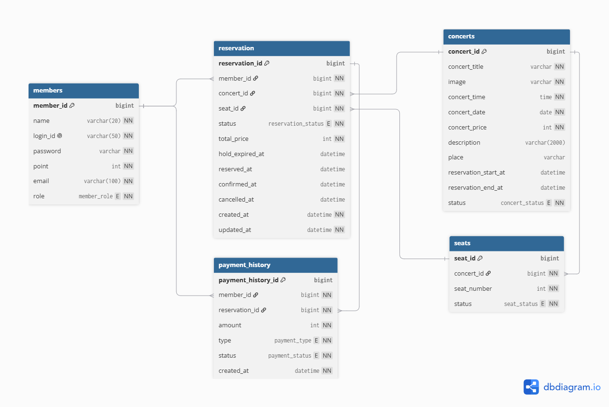

# 밍파크 (MingPark)

> **🎫 대규모 트래픽을 고려한 티켓팅 및 선착순 시스템 프로젝트**

인터파크 티켓 서비스를 벤치마킹하여, 대규모 트래픽 환경에서 발생할 수 있는 **동시성 문제**와 **서버 다운(Bottleneck)** 현상을 단계별로 해결해 나가는 백엔드 중심 챌린지 프로젝트입니다.

<br>

## 1. Technology Stack


<br>

## 2. Getting Started

> 현재는 로컬 실행을 기준으로 하며, 별도 배포는 진행하지 않았습니다. (추후 배포 예정)

### 사전 준비물
- JDK 17
- MySQL 서버
- Redis 서버 (로컬 기본값: `localhost:6379`)

### 실행 방법

```bash
# 1. 레포지토리 클론
git clone <repository-url>
cd Mingpark

# 2. 로컬 환경 설정 파일 생성 (git에 커밋되지 않음)
#    src/main/resources/application-local.properties
#    - 기본값(DB_URL/DB_USERNAME/DB_PASSWORD 미지정 시)은
#      jdbc:mysql://localhost:3306/mingpark_db, ming/ming 을 사용합니다.
#    - 필요 시 아래 값을 재정의하세요.

# 3. 애플리케이션 실행 (local 프로필)
./mvnw spring-boot:run -Dspring-boot.run.profiles=local
```

기본 프로필(`application.properties`)로 실행할 경우 아래 환경변수가 필요합니다.

| 환경변수 | 설명 | 필수 여부 |
| --- | --- | :---: |
| `DB_URL`, `DB_USERNAME`, `DB_PASSWORD` | MySQL 접속 정보 | ✅ |
| `KAKAO_REST_API_KEY`, `KAKAO_CLIENT_SECRET` | 카카오 로그인 연동 키 | 카카오 로그인 사용 시 |
| `ADMIN_LOGIN_ID`, `ADMIN_PASSWORD`, `ADMIN_EMAIL` | 최초 기동 시 관리자 계정 자동 생성/동기화 | 관리자 기능 사용 시 |

서버 기동 후 `http://localhost:8080` 에서 정적 페이지(`index.html`, `login.html`, `register.html`, `mypage.html`)에 접근할 수 있습니다.

<br>

## 3. Project Structure

```
src/main/java/com/example/mingpark/
├── config/        # Security, Redis, Password, Web(정적 업로드 리소스), 관리자 계정 초기화
├── controller/     # REST/View 컨트롤러
├── domain/         # JPA 엔티티 (Member, Concert, Seat, Reservation, PaymentHistory ...)
├── dto/            # 요청/응답 DTO
├── event/          # 결제 성공/실패 애플리케이션 이벤트
├── exception/       # 도메인 예외
├── facade/         # Redis 분산 락 퍼사드 (좌석 임시 선점)
├── repository/     # Spring Data JPA 리포지토리
├── scheduler/      # 대기열 진입 허가 스케줄러
├── security/        # CustomUserDetails(Service)
└── service/         # 비즈니스 로직
```

### 아키텍처 / ERD



`members` – `reservation` – `concerts`/`seats` – `payment_history` 관계. DBML 원본은 `docs/erd.dbml` 참고 (dbdiagram.io에서 편집 가능).

<br>

## 4. 주요 기능

| 영역 | 내용 |
| --- | --- |
| 회원 | 회원가입/로그인(세션 기반), 카카오 소셜 로그인, `/members/me` 로그인 상태 조회 |
| 공연 관리 | 공연 등록/수정/삭제(관리자 전용), 페이징 목록/상세 조회, 포스터 이미지 업로드 |
| 좌석 & 예매 | 좌석 현황 조회, Redis 기반 좌석 임시 선점(5분 TTL), 예매 생성, 포인트 기반 결제/결제 실패 처리 |
| 대기열 | Redis Sorted Set 기반 대기열 진입/상태 조회/이탈, 1초 주기 스케줄러가 활성 인원(`MAX_ACTIVE_CAPACITY`)만큼 순차 입장 허가 |
| 마이페이지 | 예매 내역 목록/상세 조회, 예매 환불(공연 시작 전에 한해 포인트 복구) |

<br>

## 5. Project Roadmap

### ✅ Step 1. 인터파크 베이스 시스템
Controller-Service-Repository 구조, 회원/공연/좌석/예매 핵심 도메인 및 CRUD API — 구현 완료

### ✅ Step 2. 대기열 시스템 (트래픽 제어)
Redis ZSET(`queue:wait:concert:{id}`)로 대기 순번을 관리하고, 스케줄러가 주기적으로 활성 큐(`queue:active:concert:{id}`)로 인원을 이관 — 구현 완료

<br>

## 6. 부하 테스트

- `src/test/java/load-test.js` — k6 스크립트 (로그인 후 좌석 예매 시나리오)
- `src/test/java/k6-direct-hold-test.js` — Before 시나리오 (대기열 게이트 없이 곧바로 `hold` 시도)
- `src/test/java/k6-waiting-test.js` — After 시나리오 (대기열 통과 후에만 `hold` 시도)
- `src/test/test.http` — 좌석 조회 API 수동 테스트

```bash
k6 run src/test/java/load-test.js
```

### 📊 대기열 게이트 적용 전/후 비교

**문제 상황**

대기열(Step 2)을 구현한 뒤에도 대기열 API(`/waiting/*`)와 좌석 선점 API(`/seats/{id}/hold`)가 서로 독립적으로 동작해, 로그인만 하면 대기열을 거치지 않고 곧바로 좌석 선점을 시도할 수 있는 우회 경로가 남아 있었습니다. 이 상태에서는 300명이 동시에 몰릴 경우 300개의 요청이 그대로 `hold` API와 Redis 락 경합으로 이어져 응답 지연과 실패율이 급증했습니다.

**해결**

`SeatController.holdSeat`에 대기열 통과 여부(`WaitingService.isAllowed`) 검사를 한 줄 추가해, 대기열을 통과(ALLOWED)한 사용자만 좌석을 선점할 수 있도록 실제 흐름을 연결했습니다.

```java
// Before: 로그인만 하면 대기열과 무관하게 바로 선점 시도
holdLockFacade.holdSeat(seatId, memberId);

// After: 대기열을 통과(ALLOWED)한 사용자만 선점 가능
if (!waitingService.isAllowed(concertId, memberId)) {
    return ResponseEntity.status(FORBIDDEN).body(...);
}
holdLockFacade.holdSeat(seatId, memberId);
```

**테스트 조건**
- 도구: K6
- 시나리오: 로그인 → (After만) 대기열 진입/폴링 → 좌석 선점(`hold`) → 예매 시도
- 부하: 300 VU, 30초
- 대상: 좌석 50석 (공연 1개), 계정 풀 300개
- 비교군: 대기열 게이트 적용 전(`k6-direct-hold-test.js`) / 후(`k6-waiting-test.js`) — 동일 조건에서 코드만 바꿔 각각 실행

**결과**

| 지표 | Before (게이트 없음) | After (대기열 게이트) | 비고 |
| --- | ---: | ---: | --- |
| `hold` 요청 수 | 2,236건 | 1,211건 | 대기열이 유입 자체를 조절 |
| `hold` 평균 응답시간 | 245.4 ms | **7.7 ms** | 약 32배 (96.9% ↓) |
| `hold` p95 응답시간 | 949.2 ms | **15.8 ms** | 약 60배 (98.3% ↓) |
| 전체 HTTP 평균 응답시간 | 960.9 ms | **118.6 ms** | 약 8배 |
| 전체 HTTP p95 응답시간 | 3.78 s | **0.88 s** | |
| 전체 요청 실패율 | 65.3% (4,969/7,605) | 15.8% (1,553/9,820) | |
| 최종 예매 성공 건수 | 50건 (전 좌석 소진) | 50건 (전 좌석 소진) | 좌석 수가 같아 결과는 동일 |
| 대기열 평균 대기시간 | – | 7.6 s (p95 20.4 s) | After만 발생하는 비용 |

**해석**

좌석이 50석으로 고정돼 있어 최종 예매 성공 건수는 두 경우 모두 같습니다. 차이는 그 50건을 처리하는 동안 백엔드(Redis/DB)가 견뎌야 했던 동시 요청의 형태에 있습니다. 게이트가 없으면 300명이 동시에 `hold`를 두드려 순간적인 쓰기 경합과 지연이 크게 튀지만(p95 949ms), 대기열이 동시 활성 인원을 `MAX_ACTIVE_CAPACITY`(50명)로 제한하면 `hold` 요청이 소규모로 나뉘어 들어와 지연이 안정적으로 낮게 유지됩니다(p95 15.8ms). 그 대가로 사용자는 평균 7.6초의 대기 시간을 감수합니다 — 순간 부하를 대기 시간으로 변환하는 것이 이 기능의 핵심입니다.

> ⚠️ 로컬 PC 한 대에서 서버·MySQL·Redis·k6 클라이언트를 동시에 돌린 결과라 절대적인 수치는 프로덕션 환경과 다를 수 있습니다. 다만 동일한 하드웨어·동일한 좌석 수·동일한 계정 풀로 전/후를 비교했으므로 상대적인 개선 폭은 유효합니다.

<br>

## 7. Team Members (99즈)

저희는 **99즈** 팀입니다. 대용량 트래픽 챌린지를 해결하기 위해 다음과 같이 역할을 나누어 협업했습니다.

| 전민규 (Team Leader) | 윤태형 | 김현정 |
| :---: | :---: | :---: |
| <br>[@전민규(조장)](https://github.com/minggure) | <br>[@윤태형](https://github.com/YunTaeng) | <br>[@김현정](https://github.com/anthia-kim) |
| **Backend Lead** | **Backend / Infra** | **Backend / QA** |
| - 프로젝트 총괄 및 도메인 설계<br>- Redis 기반 티켓팅 대기열 구현<br>- DB 성능 최적화 및 락 제어 | - 세션 기반 로그인/카카오 인증 구현<br>- Redis 분산 락 기반 좌석 임시 선점 및 대기열 시스템 구현<br>- 대기열 게이트 연동 및 k6 부하 테스트 전/후 비교 | - 핵심 도메인 비즈니스 로직 구현<br>- Locust/k6 기반 부하 테스트 시나리오 작성<br>- 병목 구간 분석 및 튜닝 |

<br>

## 8. 개인 기여 (윤태형)

커밋 이력(`git log`) 기준으로 실제 작업한 내용만 정리했습니다.

**인증 / 로그인**
- 세션 기반 로그인 핵심 비즈니스 로직 및 DTO 설계, 로그인 화면(`login.html`) 구현
- 로그인 시 해시 비밀번호 비교 적용, 로그인 성공/실패 알림(alert) 피드백 처리
- 로그아웃 시 로그인 모달 입력 필드 초기화 등 인증 흐름 버그 수정

**좌석 선점 & 분산 락**
- `concertId`/`seatId` 기반 Redis 분산 락으로 좌석 임시 선점 기능 구현 및 고도화
- 분산돼 있던 좌석 선점 로직 통합, 만료된 락을 자동 회수하는 스케줄러 도입
- 프론트엔드 좌석 클릭 시 Redis 임시 점유 API 연동

**대기열 시스템 (Step 2 핵심 구현자)**
- Redis Sorted Set 기반 동적 대기열 시스템 설계 및 구현 (대기 순번 관리 + 활성 인원 스케줄러)
- 대기열 API 접근 인가 정책 세분화
- 대기열 인증 우회 취약점, 좌석 예약 동시성 검증 취약점 발견 및 수정
- 대기열 게이트를 실제 좌석 선점 흐름에 연결하고, k6로 적용 전/후 부하 테스트를 수행해 결과를 문서화 (6번 항목)

**마이페이지 / 결제 이력**
- `PaymentHistory` 엔티티 및 관련 ENUM(결제 상태/유형) 설계
- 마이페이지 및 보유 포인트 조회 API 구현

**프론트엔드 / 구조 개선**
- `main.html` 중심 SPA 구조 전환, API v1 경로 버전 관리 적용
- `index.html`의 스타일(CSS)·마이페이지 로직을 별도 파일로 분리하는 등 정적 리소스 구조 정리

<br>

## 9. 기술적 의사결정

구현하면서 실제로 고민했던 선택지와 이유입니다.

### 좌석 임시 선점 락: Redis `SETNX` + TTL
- **선택**: `StringRedisTemplate.opsForValue().setIfAbsent(key, value, 5, MINUTES)` — 좌석 하나당 원자적 락 키 하나
- **대안**: Redisson 분산 락(재진입, watchdog 자동 연장) / DB 비관적 락(`SELECT ... FOR UPDATE`)
- **이유**: "이 좌석을 누가 먼저 잡았는가"만 판단하면 되는 단순 상호배제 문제라 Redisson의 재진입 락·락 연장 기능까지는 필요하지 않았음. DB 비관적 락은 트래픽이 몰릴 때 커넥션과 트랜잭션을 오래 붙잡게 되어, 이 프로젝트가 애초에 풀려는 "DB 병목" 문제를 좌석 선점 단계에서 그대로 재현하는 셈이라 제외.
- **못 해본 것**: Redisson 같은 라이브러리 기반 분산 락은 아직 안 써봐서, 재진입이 필요한 복잡한 락 시나리오가 생기면 다음에 써보고 싶음.

### 대기열: Redis Sorted Set(ZSET) + Set + 폴링
- **선택**: 대기자는 ZSET(score = 진입 시각)에, 활성 유저는 Set에 보관하고 스케줄러가 주기적으로 이관
- **대안**: 단순 List 기반 큐 / 메시지 브로커(비동기 큐) 기반 처리
- **이유**: 클라이언트가 "내 순번이 몇 번째인지"를 실시간으로 물어봐야 해서 순서가 보장되고 랭크 조회(`ZRANK`, O(log N))가 되는 자료구조가 필요했음. List 큐는 특정 유저의 순번을 바로 조회하기 어렵고, 메시지 브로커는 "순서 유지 + 동시 활성 인원 제한"이라는 요구사항엔 오히려 과한 인프라라고 판단.
- **못 해본 것**: 메시지 브로커 기반 비동기 처리는 실제로 써본 적이 없어서, 이번엔 검증된 방식(Redis)으로 안전하게 갔음. 다음엔 시도해보고 싶은 부분.

### 인증: 세션(Spring Security + JSESSIONID) vs JWT
- **선택**: 세션 기반 인증. (`SecurityConfig` 주석에도 "JWT가 아니라 세션 방식이므로 필요할 때 세션 생성"이라고 명시)
- **이유**: 정적 HTML + fetch 조합이라 별도 토큰 저장/갱신 로직 없이 브라우저 쿠키만으로 충분했고, 서버가 한 대뿐인 현재 구조에서는 세션 스케일아웃 이슈도 아직 없음.
- **못 해본 것**: 서버를 여러 대로 늘리면 세션 클러스터링(Redis 세션 스토어) 또는 JWT 전환이 필요할 텐데, 아직 안 해봐서 다음 단계로 미뤄둠.

### 결제: 자체 포인트 시스템 vs 외부 PG 연동
- **선택**: 포인트 잔액을 직접 차감/복구하는 자체 로직, 결제 성공/실패를 `PaymentSucceededEvent`/`PaymentFailedEvent`로 분리 처리
- **이유**: 이 프로젝트의 핵심은 결제 자체가 아니라 "동시성 제어와 트래픽 처리"였기 때문에, 실제 PG 연동까지 범위를 넓히지 않고 좌석 확정·포인트 복구 같은 후속 처리 흐름에 집중.

<br>

## 10. API 명세 (요약)

| 영역 | Method | Endpoint | 설명 | 인증 |
| --- | --- | --- | --- | :---: |
| 회원 | POST | `/members/signup` | 회원가입 | - |
| 회원 | POST | `/members/login` | 로그인 | - |
| 회원 | GET | `/members/me` | 로그인 상태 조회 | - |
| 회원 | GET | `/members/kakao/login`, `/members/kakao/callback` | 카카오 소셜 로그인 | - |
| 공연 | GET | `/api/concerts` | 공연 목록(페이징) | - |
| 공연 | GET | `/api/concerts/{concertId}` | 공연 상세 | - |
| 공연 | POST / PUT / DELETE | `/api/concerts`, `/api/concerts/{concertId}` | 공연 등록/수정/삭제 | ADMIN |
| 공연 | POST | `/api/concert-images` | 포스터 이미지 업로드 | ADMIN |
| 좌석 | GET | `/api/concerts/{concertId}/seats` | 좌석 현황 조회 | ✅ |
| 좌석 | POST | `/api/concerts/{concertId}/seats/{seatId}/hold` | 좌석 임시 선점 (5분 TTL) | ✅ |
| 예매 | POST | `/api/concerts/{concertId}/seats/{seatId}/reservations` | 예매 생성 | ✅ |
| 결제 | POST | `/api/reservations/{reservationId}/payment` | 포인트 결제 | ✅ |
| 결제 | POST | `/api/reservations/{reservationId}/fail` | 결제 실패 처리 | ✅ |
| 대기열 | POST | `/api/concerts/{concertId}/waiting/join` | 대기열 진입 | ✅ |
| 대기열 | GET | `/api/concerts/{concertId}/waiting/status` | 대기 상태/순번 조회 | ✅ |
| 대기열 | POST | `/api/concerts/{concertId}/waiting/leave` | 대기열/활성 큐 이탈 | ✅ |
| 마이페이지 | GET | `/api/users/me/points` | 보유 포인트 조회 | ✅ |
| 마이페이지 | GET | `/api/users/me/reservations` | 예매 내역 목록 | ✅ |
| 마이페이지 | GET | `/api/users/me/reservations/{reservationId}` | 예매 상세 | ✅ |
| 마이페이지 | POST | `/api/users/me/reservations/{reservationId}/refund` | 예매 환불 | ✅ |

전체 요청/응답 필드는 각 컨트롤러와 매핑되는 DTO(`dto/`)를 참고하세요.
