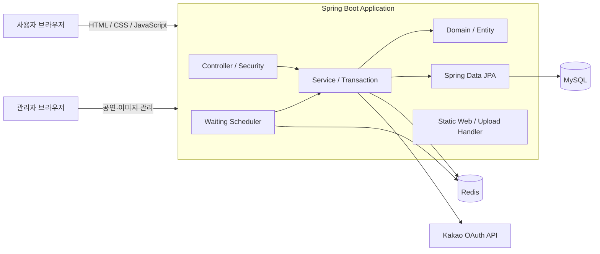
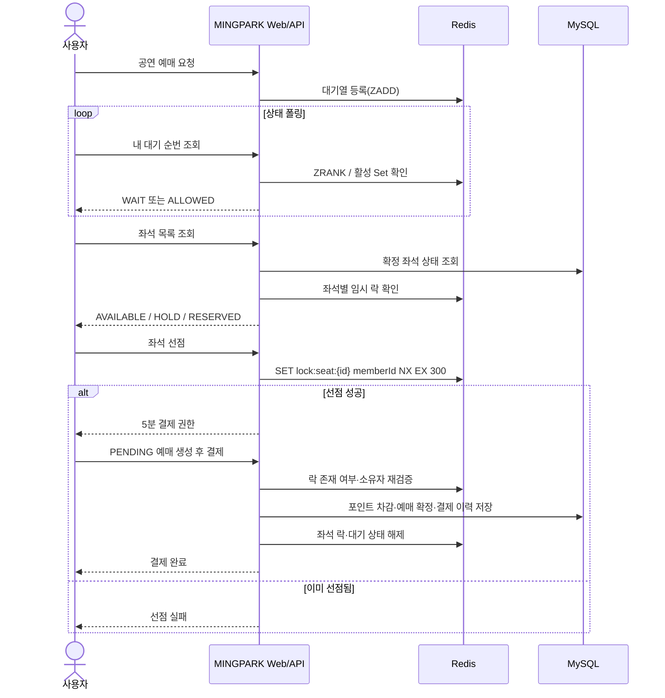
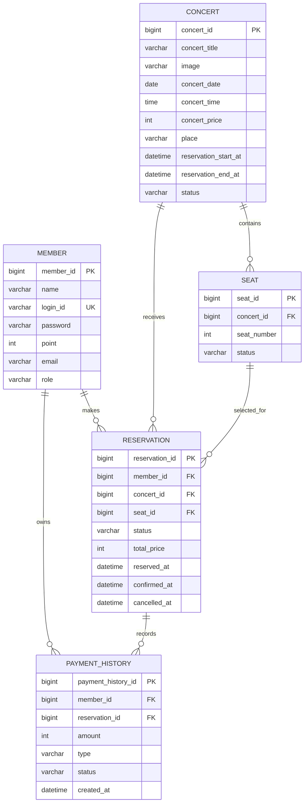

# MINGPARK

> 공연 탐색부터 대기열, 좌석 선점, 포인트 결제와 환불까지 한 흐름으로 구현한 공연 티켓 예매 서비스


## 목차

1. [프로젝트 소개](#1-프로젝트-소개)
2. [팀원 및 담당 영역](#2-팀원-및-담당-영역)
3. [핵심 기능](#3-핵심-기능)
4. [기술 스택](#4-기술-스택)
5. [아키텍처](#5-아키텍처)
6. [핵심 예매 흐름](#6-핵심-예매-흐름)
7. [ERD / 데이터 모델](#7-erd--데이터-모델)
8. [API](#8-api)
9. [트러블슈팅 / 기술적 의사결정](#9-트러블슈팅--기술적-의사결정)
10. [테스트](#10-테스트)
11. [실행 방법](#11-실행-방법)
12. [디렉터리 구조](#12-디렉터리-구조)
13. [현재 한계와 개선 계획](#13-현재-한계와-개선-계획)

## 1. 프로젝트 소개

MINGPARK는 인터파크 티켓의 사용자 흐름을 참고해 만든 공연 티켓 예매 서비스입니다. 사용자는 공연을 조회하고 대기 순번을 받은 뒤 좌석을 5분간 선점해 포인트로 결제할 수 있습니다. 관리자는 공연과 포스터를 등록·수정·삭제할 수 있고, 사용자는 마이페이지에서 예매 내역 조회와 공연 시작 전 환불을 처리할 수 있습니다.

이 프로젝트의 핵심 과제는 여러 사용자가 같은 좌석을 동시에 선택하는 상황에서 중복 선점을 막고, 결제하지 않은 좌석이 계속 잠겨 있지 않도록 자동 회수하는 것이었습니다. 이를 위해 영속 데이터는 MySQL에 저장하고, 짧은 수명의 대기열·입장 권한·좌석 선점 상태는 Redis로 분리했습니다.

### 프로젝트 정보

| 항목 | 내용 |
| --- | --- |
| 유형 | 3인 팀 프로젝트 |
| 개발 기간 | 2026.06.01 ~ 2026.07.07 |
| 서비스 형태 | Spring Boot 단일 애플리케이션에 REST API와 정적 웹을 함께 구성 |
| 핵심 목표 | 예매 대기 인원 제어, 동일 좌석 중복 선점 방지, 선점 만료와 결제 상태 정합성 유지 |
| 저장소 | [github.com/minggure/Mingpark](https://github.com/minggure/Mingpark) |

## 2. 팀원 및 담당 영역

담당 영역은 저장소의 커밋·병합 이력과 최종 코드를 기준으로 정리했습니다.

| 팀원 | 역할 | 주요 담당 |
| --- | --- | --- |
| [전민규 ](https://github.com/minggure) | 팀장 / Backend | 프로젝트 초기 구조와 회원·예매 도메인, 공연 목록·등록·수정·삭제, 좌석 조회·Redis 임시 선점과 TTL 만료 처리, 결제 화면, k6 부하 시나리오, 최종 통합 및 오류 수정 |
| [윤태형 ](https://github.com/YunTaeng) | Backend / Web | 로그인과 세션 인증, 결제 이력 모델, DTO 불변성 개선, SPA 상세 조회 연동, Redis 좌석 락 고도화, 마이페이지·보유 포인트, Redis 동적 대기열과 접근 정책, 정적 리소스 분리 |
| [김현정 ](https://github.com/anthia-kim) | Backend / Web | 공연·좌석 엔티티, 회원가입·입력 검증·비밀번호 암호화, 공연 상세 화면, 관리자 공연 등록 권한, Spring Security 세션 전환, 카카오 로그인, 포인트 결제·예매 생성, 예매 목록·상세 조회 |

### 전민규 담당 상세

- 프로젝트 기본 패키지와 Controller–Service–Repository 계층 구성
- `Member`, `Reservation` 및 상태 Enum을 포함한 초기 도메인 설계
- 공연 최신순 페이징 조회와 등록 시 공연별 기본 좌석 50개 일괄 생성
- 관리자 공연 수정·삭제 API와 화면 연동
- 삭제 시 `결제 이력 → 예매 → 좌석 → 공연` 순서로 연관 데이터 정리
- 공연별 좌석 조회 API와 Redis 연동 기반 실시간 `HOLD` 상태 합성
- `SET NX + TTL` 방식의 좌석별 5분 임시 선점 구현
- 선점 만료, 결제 실패, 사용자 이탈 시 좌석 락 해제 흐름 구현
- 결제 확인 모달과 결제 제한 시간 만료 안내 처리
- 세션 로그인 후 예매 API를 반복 호출하는 k6 시나리오 작성
- 기능 브랜치 통합과 공연 수정·삭제 등 최종 오류 수정

## 3. 핵심 기능

### 공연 탐색과 관리자 운영

- 공연 목록을 최신 등록순으로 페이징 조회합니다.
- 공연 일시, 장소, 가격, 설명, 포스터와 예매 가능 기간을 제공합니다.
- `ON_SALE` 상태이면서 현재 시각이 예매 시작·종료 시각 사이인 경우에만 예매 버튼을 활성화합니다.
- 관리자는 공연 포스터를 업로드하고 공연을 등록·수정·삭제할 수 있습니다.
- 공연 등록 시 1번부터 50번까지의 좌석을 함께 생성합니다.

### 회원과 인증

- 일반 회원가입 시 로그인 ID 중복을 검사하고 비밀번호를 암호화해 저장합니다.
- JSON 로그인 API가 인증에 성공하면 Spring Security 세션을 생성합니다.
- 카카오 OAuth 인가 코드로 사용자 정보를 조회하고 기존 회원 로그인 또는 신규 회원 생성을 처리합니다.
- 일반 사용자와 관리자의 역할을 구분해 공연 등록·이미지 업로드 권한을 제한합니다.

### Redis 기반 예매 대기열

- Redis Sorted Set에 진입 시각을 점수로 저장해 공연별 대기 순서를 유지합니다.
- 이미 대기 중인 사용자가 다시 요청해도 기존 순번을 유지합니다.
- 스케줄러가 1초마다 공연별 활성 인원을 확인하고 최대 50명까지 입장을 허용합니다.
- 입장 허가 사용자는 Redis Set으로 분리하며 활성 권한에는 5분 TTL을 적용합니다.
- 결제 완료 또는 대기열 이탈 시 대기·활성 상태를 정리합니다.

### 좌석 선점과 결제

- MySQL의 확정 좌석 상태와 Redis의 임시 락을 결합해 `AVAILABLE`, `HOLD`, `RESERVED` 상태를 반환합니다.
- Redis `setIfAbsent`로 동일 좌석의 첫 요청만 성공시키고 좌석별 락을 5분 뒤 자동 만료합니다.
- 결제 직전에 락 존재 여부와 락 소유자를 다시 검사해 만료되거나 다른 사용자가 선점한 좌석의 결제를 거절합니다.
- 결제 성공 시 포인트를 차감하고 예매·좌석 상태와 결제 이력을 하나의 트랜잭션에서 변경합니다.
- 포인트 부족 또는 사용자 취소 시 실패 이력을 남기고 좌석을 다시 사용할 수 있게 합니다.

### 마이페이지와 환불

- 로그인 사용자의 프로필과 보유 포인트를 조회합니다.
- 결제가 완료된 `RESERVED` 예매만 최신순으로 조회합니다.
- 예매 ID와 회원 ID를 함께 조건으로 사용해 다른 사용자의 예매 상세 접근을 막습니다.
- 공연 시작 전에는 포인트를 복구하고 예매와 좌석을 취소 상태로 변경하며 환불 이력을 저장합니다.

## 4. 기술 스택

| 구분 | 기술 | 사용 목적 |
| --- | --- | --- |
| Language | Java 17 | 애플리케이션 구현 |
| Framework | Spring Boot 4.0.6, Spring MVC | REST API, 정적 웹 제공, 애플리케이션 구성 |
| Security | Spring Security, BCrypt, HTTP Session | 회원 인증, 역할 기반 인가, 비밀번호 단방향 암호화 |
| Persistence | Spring Data JPA, Hibernate | 도메인 영속화와 연관 데이터 조회 |
| Database | MySQL | 회원, 공연, 좌석, 예매, 결제 이력의 최종 저장 |
| In-memory Store | Redis, Lettuce | 대기 순번, 입장 권한, 좌석별 임시 락과 TTL 관리 |
| External API | Spring `RestClient`, Kakao OAuth | 카카오 토큰·사용자 정보 연동 |
| Frontend | HTML, CSS, Vanilla JavaScript | 공연·좌석·결제·마이페이지 화면과 Fetch API 연동 |
| Test | JUnit 5, Spring Boot Test, k6 | 애플리케이션 컨텍스트와 예매 요청 부하 시나리오 |
| Build | Maven Wrapper | 의존성 관리와 빌드 |

## 5. 아키텍처



MINGPARK는 별도 프론트엔드 서버 없이 Spring Boot가 정적 웹과 API를 함께 제공합니다. MySQL은 확정된 비즈니스 데이터를, Redis는 만료 가능한 런타임 상태를 담당합니다.

### Redis 키 설계

| 키 | 자료구조 | 값 / 점수 | 용도 |
| --- | --- | --- | --- |
| `queue:wait:concert:{concertId}` | Sorted Set | 회원 ID / 진입 시각 | 공연별 대기 순서와 순번 계산 |
| `queue:active:concert:{concertId}` | Set | 회원 ID | 예매 화면 진입 허가 상태, 5분 TTL |
| `lock:seat:{seatId}` | String | 선점 회원 ID | 동일 좌석 중복 선점 방지, 5분 TTL |

## 6. 핵심 예매 흐름



## 7. ERD / 데이터 모델



### 상태 모델

| 도메인 | 상태 | 의미 |
| --- | --- | --- |
| 공연 | `UPCOMING`, `ON_SALE`, `CLOSED`, `ENDED`, `INACTIVE` | 공연과 예매 진행 상태 |
| 좌석 | `AVAILABLE`, `HOLD`, `RESERVED` | 예매 가능, 임시 선점, 결제 확정 |
| 예매 | `PENDING`, `RESERVED`, `CANCELLED` | 결제 대기, 결제 완료, 실패·취소 |
| 결제 | `SUCCESS`, `FAILED` | 결제·환불 이력 처리 결과 |
| 결제 유형 | `PAYMENT`, `REFUND` | 포인트 차감 또는 복구 구분 |

`(concert_id, seat_number)`에는 유일성 제약을 두어 한 공연 안에서 좌석 번호가 중복되지 않게 했습니다.

## 8. API

### 회원 / 인증

| Method | Endpoint | 인증 | 설명 |
| --- | --- | --- | --- |
| `POST` | `/members/signup` | 공개 | 일반 회원가입 |
| `POST` | `/members/login` | 공개 | 로그인 후 HTTP 세션 생성 |
| `POST` | `/members/logout` | 로그인 | 세션 무효화와 `JSESSIONID` 삭제 |
| `GET` | `/members/me` | 선택 | 현재 로그인 사용자 조회 |
| `GET` | `/members/kakao/login` | 공개 | 카카오 로그인 화면으로 이동 |
| `GET` | `/members/kakao/callback` | 공개 | 카카오 인가 코드 처리와 세션 생성 |

### 공연 / 이미지

| Method | Endpoint | 인증 | 설명 |
| --- | --- | --- | --- |
| `GET` | `/api/concerts?page=0&size=6` | 공개 | 공연 목록 페이징 조회 |
| `GET` | `/api/concerts/{concertId}` | 공개 | 공연 상세와 예매 가능 여부 조회 |
| `POST` | `/api/concerts` | 관리자 | 공연 등록과 좌석 50개 생성 |
| `PUT` | `/api/concerts/{concertId}` | 관리자 확인 | 공연 수정 |
| `DELETE` | `/api/concerts/{concertId}` | 관리자 확인 | 공연과 연관 데이터 삭제 |
| `POST` | `/api/concert-images` | 관리자 | 공연 포스터 업로드 |

### 대기열 / 좌석 / 예매

| Method | Endpoint | 인증 | 설명 |
| --- | --- | --- | --- |
| `POST` | `/api/concerts/{concertId}/waiting/join` | 로그인 확인 | 대기열 진입 또는 기존 순번 조회 |
| `GET` | `/api/concerts/{concertId}/waiting/status` | 로그인 확인 | 대기·입장 허가 상태 조회 |
| `POST` | `/api/concerts/{concertId}/waiting/leave` | 로그인 확인 | 대기열과 입장 권한 제거 |
| `GET` | `/api/concerts/{concertId}/seats` | 로그인 | DB·Redis 통합 좌석 상태 조회 |
| `POST` | `/api/concerts/{concertId}/seats/{seatId}/hold` | 로그인 확인 | 좌석을 5분간 임시 선점 |
| `POST` | `/api/concerts/{concertId}/seats/{seatId}/reservations` | 로그인 확인 | `PENDING` 예매 생성 |
| `POST` | `/api/reservations/{reservationId}/payment` | 로그인 | 포인트 결제 확정 |
| `POST` | `/api/reservations/{reservationId}/fail` | 로그인 | 결제 실패·이탈 처리 |

### 마이페이지

| Method | Endpoint | 인증 | 설명 |
| --- | --- | --- | --- |
| `GET` | `/api/users/me/points` | 로그인 | 프로필과 보유 포인트 조회 |
| `GET` | `/api/users/me/reservations` | 로그인 | 결제 완료 예매 목록 조회 |
| `GET` | `/api/users/me/reservations/{reservationId}` | 로그인 | 본인 예매 상세 조회 |
| `POST` | `/api/users/me/reservations/{reservationId}/refund` | 로그인 | 공연 시작 전 포인트 환불 |

`로그인 확인`과 `관리자 확인`은 Security Filter에서 일괄 차단하지 않고 Controller에서 사용자·역할 존재 여부를 검사하는 현재 구현을 뜻합니다.

## 9. 트러블슈팅 / 기술적 의사결정

### 9.1 동일 좌석 동시 선점 경쟁

**문제 상황**

좌석 상태를 먼저 조회하고 나중에 갱신하는 방식에서는 여러 사용자가 거의 동시에 같은 좌석을 선택했을 때 모두 빈 좌석으로 판단할 수 있었습니다.

**원인**

`조회 → 판단 → 저장`이 하나의 원자 연산이 아니므로 두 요청 사이에 경합 구간이 생겼습니다. DB에 임시 상태를 계속 기록하면 짧은 선점 요청이 집중될 때 쓰기 부하와 만료 정리 비용도 함께 증가합니다.

**해결**

- 좌석 ID를 기준으로 `lock:seat:{seatId}` Redis 키를 분리했습니다.
- `setIfAbsent`를 사용해 키가 없을 때만 회원 ID와 TTL을 한 번에 기록했습니다.
- 이미 키가 존재하면 두 번째 요청을 즉시 거절했습니다.
- 확정 결제 상태는 MySQL에 저장하고 Redis는 5분짜리 임시 선점에만 사용했습니다.

**결과**

같은 좌석에 대한 경합은 Redis의 단일 원자 연산 결과로 결정되며, 선점 상태와 확정 상태의 책임이 분리됐습니다. 저장소에는 동시 요청 성공 건수나 p95 같은 정량 결과가 남아 있지 않아 수치 성과는 기재하지 않았습니다.

### 9.2 스케줄러 기반 일괄 해제에서 좌석별 TTL로 전환

**문제 상황**

만료 좌석을 주기적으로 찾아 해제하는 과정에서 서로 다른 시점에 선점된 좌석들이 한 번에 풀리는 문제가 발생했습니다.

**원인**

공통 주기의 스케줄러가 만료 시점을 개별 좌석 단위로 정확히 보존하지 못하면, 나중에 선점한 좌석까지 같은 정리 주기에 영향을 받을 수 있습니다. 만료 대상 탐색과 삭제 사이에도 추가 경합이 생깁니다.

**해결**

- 좌석 선점 시 Redis 키에 5분 TTL을 함께 설정했습니다.
- 좌석마다 독립된 만료 시계를 갖도록 만들었습니다.
- 결제 성공·실패처럼 TTL을 기다릴 필요가 없는 경우에는 해당 좌석 키를 즉시 삭제했습니다.
- 좌석 조회 시 DB 상태를 바꾸지 않고 Redis 키가 존재하는 좌석만 동적으로 `HOLD`로 합성했습니다.

**결과**

별도 좌석 해제 스케줄러 없이 각 좌석이 실제 선점 시각을 기준으로 자동 해제되도록 단순화했습니다.

### 9.3 선점 만료 뒤 결제가 진행되는 문제 방어

**문제 상황**

사용자가 결제 모달을 오래 열어 둔 경우 화면에는 결제 버튼이 남아 있지만 Redis 선점 키는 이미 만료될 수 있었습니다. 화면 상태만 믿고 결제하면 선점 권한이 없는 좌석이 확정될 위험이 있었습니다.

**원인**

브라우저의 남은 시간 표시는 사용자 안내용이며 서버의 Redis TTL과 완전히 같은 시점에 끝난다고 보장할 수 없습니다. 네트워크 지연이나 백그라운드 탭 타이머 지연도 발생할 수 있습니다.

**해결**

- 결제 직전에 `lock:seat:{seatId}`를 다시 조회합니다.
- 키가 없으면 `결제 시간이 초과`된 요청으로 거절합니다.
- 키의 회원 ID가 결제 요청자와 다르면 다른 사용자의 선점으로 판단해 거절합니다.
- 프론트엔드에도 시간 초과 메시지와 결제 실패 API 호출을 연결했습니다.

**결과**

최종 결제 판단을 화면 타이머가 아니라 서버의 선점 상태와 소유자 검증에 두었습니다.

### 9.4 모든 사용자가 동시에 예매 API로 진입하는 문제

**문제 상황**

인기 공연에서 다수 사용자가 좌석 조회와 선점 API에 바로 접근하면 애플리케이션과 DB가 요청 집중을 그대로 받게 됩니다.

**원인**

진입 순서와 현재 처리 중인 인원을 구분하는 계층이 없었고, 요청을 제한할 기준도 없었습니다.

**해결**

- 공연별 Redis Sorted Set에 최초 요청 시각을 점수로 저장했습니다.
- `ZRANK`로 중복 등록 없이 사용자 순번을 계산했습니다.
- 입장 허가 사용자는 별도 Set으로 옮겨 대기자와 구분했습니다.
- 1초 주기 스케줄러가 현재 활성 인원을 기준으로 최대 50명까지 빈자리를 보충합니다.
- 활성 Set에는 5분 TTL을 두고 결제 완료·이탈 시 사용자를 즉시 제거했습니다.

**결과**

대기 순서를 유지하면서 예매 단계의 동시 활성 인원을 제한하는 흐름을 구성했습니다. 현재 구현의 원자성·확장성 한계는 [개선 계획](#13-현재-한계와-개선-계획)에 별도로 명시했습니다.

### 9.5 공연 삭제 시 외래 키 제약 오류

**문제 상황**

예매와 결제 이력이 있는 공연을 바로 삭제하면 해당 공연을 참조하는 자식 데이터 때문에 삭제가 실패했습니다.

**원인**

공연은 좌석과 예매에서 참조되고, 결제 이력은 다시 예매를 참조합니다. 부모 공연부터 삭제하면 외래 키 의존 순서를 거스르게 됩니다.

**해결**

- 하나의 트랜잭션 안에서 결제 이력을 먼저 삭제합니다.
- 이어서 예매, 좌석, 공연 순으로 삭제합니다.
- 각 Repository에 공연 ID 기준 벌크 삭제 쿼리를 분리했습니다.

**결과**

참조 관계의 가장 말단부터 정리해 공연 수정·삭제 흐름에서 발생하던 연관 데이터 오류를 해결했습니다.

### 주요 기술적 결정

| 주제 | 선택 | 이유 |
| --- | --- | --- |
| 임시 선점 저장소 | Redis 문자열 키 + TTL | 원자적 선점과 자동 만료가 필요하고 확정 데이터가 아니기 때문 |
| 확정 상태 저장소 | MySQL | 회원 포인트, 예매, 좌석과 결제 이력을 트랜잭션으로 변경하기 위해 |
| 대기 순서 | Redis Sorted Set | 진입 시각 순 정렬과 순번 조회를 지원하기 때문 |
| 입장 사용자 | Redis Set | 중복 없는 포함 여부 확인과 제거가 필요하기 때문 |
| 인증 | Spring Security HTTP Session | 동일 애플리케이션이 정적 웹과 API를 제공하는 구조에 맞추기 위해 |
| 마이페이지 조회 | JPA Fetch Join | 예매 목록·상세에 필요한 공연과 좌석을 함께 조회하기 위해 |

## 10. 테스트

### 현재 포함된 테스트

- `MingparkApplicationTests`: Spring 애플리케이션 컨텍스트 로딩 테스트
- `src/test/java/load-test.js`: 로그인한 가상 사용자 10명이 100초 동안 동일 예매 생성 API를 호출하는 k6 시나리오
- `src/test/test.http`: 좌석 조회 API를 수동 호출하기 위한 HTTP 요청

### 실행 명령

```bash
# 단위·컨텍스트 테스트
./mvnw test

# 애플리케이션 실행 후 k6 부하 시나리오
k6 run src/test/java/load-test.js
```

k6 스크립트는 동일 좌석 요청에서 `200` 또는 `400` 응답을 확인하지만, 저장소에 부하 테스트 결과 파일은 포함되어 있지 않습니다. 따라서 처리량·응답 시간 개선 수치는 README에 추정해 적지 않았습니다.

### 검증 상태

- `./mvnw -DskipTests package`: 성공
- `./mvnw test`: 테스트 전용 Profile이 없어 실제 `DB_URL`, 계정과 스키마가 준비된 환경에서 실행해야 합니다. DB 환경변수가 없는 상태에서는 DataSource 생성 단계에서 컨텍스트 테스트가 실패합니다.

## 11. 실행 방법

### 사전 준비

- JDK 17
- MySQL
- Redis (`localhost:6379`)
- 카카오 로그인을 사용할 경우 Kakao Developers 애플리케이션과 Redirect URI 등록

현재 JPA 설정은 `ddl-auto=validate`이므로 운영 방식으로 실행할 때는 엔티티와 일치하는 테이블이 미리 존재해야 합니다. 별도 migration 파일은 아직 포함되어 있지 않습니다.

### 1. 저장소 복제

```bash
git clone https://github.com/minggure/Mingpark.git
cd Mingpark
```

### 2. MySQL 데이터베이스 준비

```sql
CREATE DATABASE mingpark
    CHARACTER SET utf8mb4
    COLLATE utf8mb4_unicode_ci;
```

로컬에서 스키마를 처음 생성할 때만 `SPRING_JPA_HIBERNATE_DDL_AUTO=update`를 사용할 수 있습니다. 스키마가 생성된 뒤에는 기본값인 `validate` 사용을 권장합니다.

### 3. 환경변수 설정

```bash
export DB_URL='jdbc:mysql://localhost:3306/mingpark?serverTimezone=Asia/Seoul&characterEncoding=UTF-8'
export DB_USERNAME='your_mysql_username'
export DB_PASSWORD='your_mysql_password'

# 최초 로컬 스키마 생성 시에만 사용
export SPRING_JPA_HIBERNATE_DDL_AUTO='update'

# 선택: 카카오 로그인
export KAKAO_REST_API_KEY='your_kakao_rest_api_key'
export KAKAO_CLIENT_SECRET='your_kakao_client_secret'

# 선택: 실행 시 관리자 계정 생성 또는 갱신
export ADMIN_LOGIN_ID='admin'
export ADMIN_PASSWORD='change-me'
export ADMIN_EMAIL='admin@example.com'
export ADMIN_NAME='관리자'
```

카카오 Redirect URI는 기본적으로 `http://localhost:8080/members/kakao/callback`입니다.

### 4. Redis와 애플리케이션 실행

```bash
# Redis를 로컬 서비스로 실행한 뒤
./mvnw spring-boot:run
```

브라우저에서 `http://localhost:8080`으로 접속합니다. 업로드한 포스터는 실행 디렉터리의 `uploads/`에 저장되고 `/uploads/**` 경로로 제공됩니다.

## 12. 디렉터리 구조

```text
mingpark/
├─ src/main/java/com/example/mingpark/
│  ├─ config/       # Security, Redis, Web MVC, 관리자 초기화 설정
│  ├─ controller/   # 회원·공연·좌석·대기열·예매·결제·마이페이지 API
│  ├─ domain/       # JPA 엔티티와 상태 Enum
│  ├─ dto/          # API 요청·응답 모델
│  ├─ event/        # 결제 성공·실패 이벤트 모델
│  ├─ exception/    # 공연 조회 예외
│  ├─ facade/       # Redis 좌석 선점·해제 경계
│  ├─ repository/   # Spring Data JPA Repository
│  ├─ scheduler/    # 공연별 대기열 입장 스케줄러
│  ├─ security/     # 세션 인증 사용자와 UserDetailsService
│  └─ service/      # 도메인 유스케이스와 트랜잭션
├─ src/main/resources/
│  ├─ static/       # HTML, CSS, JavaScript, 이미지
│  └─ application.properties
├─ src/test/
│  ├─ java/...      # Spring Boot 컨텍스트 테스트와 k6 스크립트
│  └─ test.http     # 수동 API 요청
├─ pom.xml
├─ mvnw
└─ README.md
```

## 13. 현재 한계와 개선 계획

### 현재 한계

- 대기열 이동이 `조회 → 활성 Set 추가 → 대기 ZSet 제거`의 여러 Redis 명령으로 구성되어 원자적이지 않습니다.
- 스케줄러가 Redis `KEYS`로 모든 공연 대기열을 탐색해 키 수가 커지면 Redis를 블로킹할 수 있습니다.
- 활성 사용자 TTL을 공연별 Set 전체에 적용하므로 새 입장 배치가 기존 사용자의 만료 시각에도 영향을 줍니다.
- 예매 생성 API가 Redis 선점 소유자와 좌석–공연 일치 여부를 직접 검증하지 않고, 결제 단계에서만 락 소유자를 검사합니다.
- 동일 회원·좌석의 `PENDING` 예매 중복을 막는 DB 유일성 제약이 없습니다.
- 결제 이벤트 객체는 발행하지만 현재 저장소에는 이를 처리하는 Listener가 없습니다.
- 자동화 테스트가 컨텍스트 로딩 수준이며 동시성·인증·결제·환불 통합 테스트와 확정된 성능 결과가 없습니다.
- `pom.xml`에 Redis Starter가 중복 선언되어 Maven model 경고가 발생합니다.
- Flyway 같은 스키마 migration과 Docker 기반 로컬 인프라 구성이 없습니다.

### 개선 계획

- Lua Script로 대기열 이동과 좌석 선점 검증을 원자화합니다.
- `KEYS` 대신 관리 대상 공연 키 집합 또는 `SCAN`을 사용하고, 다중 인스턴스에서는 스케줄러 리더 선출을 적용합니다.
- 활성 권한을 사용자별 TTL 키로 분리해 각 사용자의 정확한 만료 시점을 보장합니다.
- 예매 생성 시 공연–좌석 관계, 좌석 상태와 Redis 락 소유자를 한 번 더 검증하고 DB 제약을 추가합니다.
- 결제·환불에서 회원과 좌석 행 잠금 또는 낙관적 락을 적용하고 동시성 통합 테스트로 검증합니다.
- Testcontainers로 MySQL·Redis 통합 테스트 환경을 만들고, 동일 좌석 다중 요청과 TTL 경계 조건을 자동화합니다.
- Flyway와 Docker Compose를 추가해 새 환경에서도 동일 스키마와 인프라를 재현합니다.
- k6 결과를 JSON 또는 대시보드 Snapshot으로 보존해 변경 전후 처리량·지연·실패율을 같은 조건에서 비교합니다.
